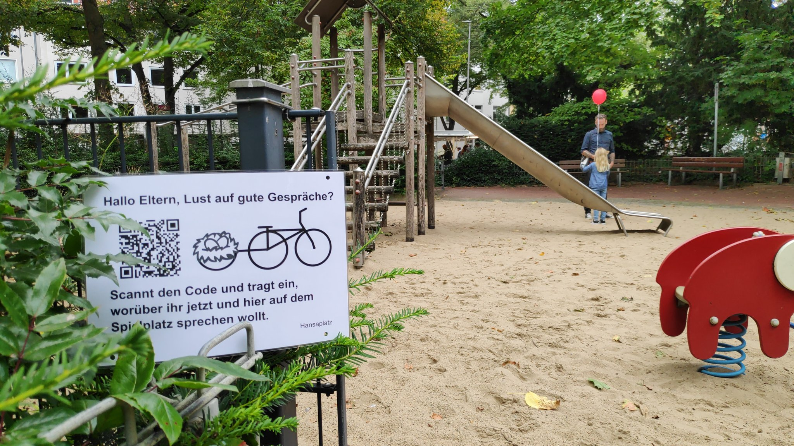

Spielplatz-Talk für Münsters Spielplätze - Beitrag zur [Münsterhack21](https://muensterhack.de/)
================================================================================================

Dieses Repository beinhaltet einen kleinen Code der eine Website betreibt, auf der
man Themen-Stichworte geolokal posten kann. Damit soll Nutzer:innen ermöglicht werden,
Kontakte zu knüpfen.

Grundlage des Projektes sind die offenen Geodaten unter
https://opendata.stadt-muenster.de/dataset/kinderspielpl%C3%A4tze
(siehe [Visualisierung](https://geo7.stadt-muenster.de/webgis/map/?wmsurl=https://www.stadt-muenster.de/ows/mapserv706/odspielplserv&wmslayer=spielplaetze&titel=Spielpl%C3%A4tze)), die als GeoJSON
diesem Repository beiliegen. Dort hat jeder Spielplatz eine ID (dreistellige Dezimalzahl).
Dieser wurden zusätzlich *Secrets* beigefügt, die tatsächlich einfach von
https://www.random.org/passwords/ stammen und per Excel in einer CSV-File zusammengebastelt
wurden (`spielplaetze-secrets.csv`). Diese *Secrets* haben mehrere Funktionen:

* Sie sind ein naiver Versuch, sicherzustellen, dass nur auf einem Spielplatz gepostet
  werden kann, da sie nur über QR-Codes verteilt werden (naja, und dieses Repository,
  aber es ist ja nur ein Demonstrator)
* Sie erlauben das einfache formlose Zusammenbauen von URLs und dienen damit auch als
  "Login".
* Sie bilden mit den trivialen fortlaufenden IDs der Geodaten als Tupel komplexere
  defakto-IDs die nicht einfach zu erraten sind.

Das *Backend* selbst ist ein PHP-File im Stil der 90er-Jahre. Das ist Absicht: Kein
Framework, nur CSV-Files, keine Datenbank, keep it simple, stupid. Das PHP-File hat
weniger als 100 Zeilen. Die Darstellung passiert komplett per JavaScript im Browser
mittels https://leafletjs.com/, die Files werden per AJAX geladen.

Die URLs zum Posten sind denkbar einfach zusammengebaut:
`http://example.com/pfad/zum/index.php?id-passwort-sonstiger-text`. Solche URLs
werden dann auf QR-Codes auf den Spielplätzen verteilt, wie hier exemplarisch
am [Spielplatz Hansaplatz](https://spielplatz-muenster.de/spielplatz-hansaplatz/)
geschehen:

Das Hosting dieses trivialen PHP-Files habe ich während dem Hackathon selber gemacht,
während die Subdomain https://spielplatz.muenster.dev/ von einem anderen Projekt
gestellt wurde, siehe 
[Twitter-Accounts zu muenster.dev](https://twitter.com/DigitalHubMs/status/1441827841960824832).

Die gesamte Entwicklung und Umsetzung des Projektes hat ca 90 Minuten gedauert.
Code ist Public Domain.
